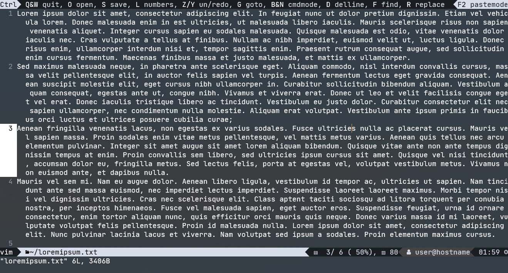
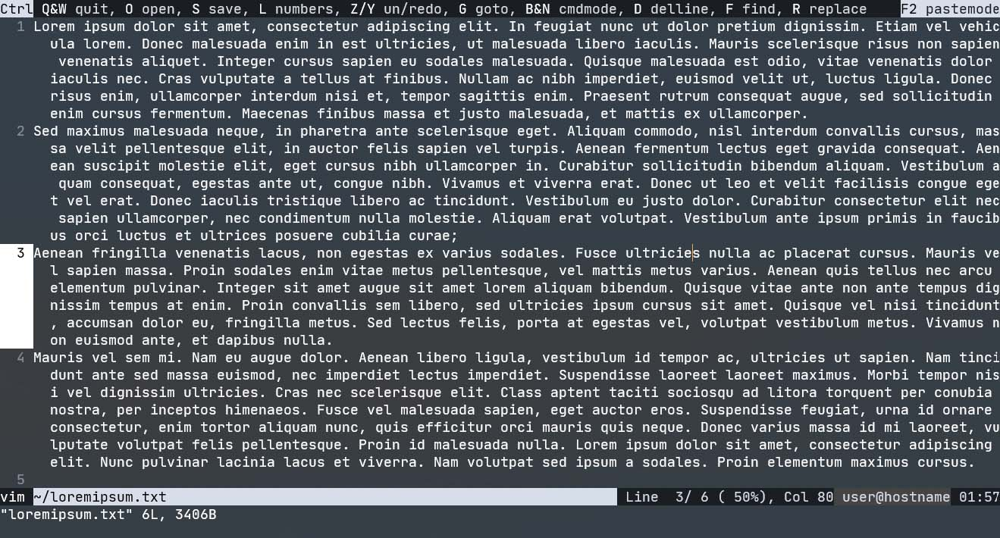
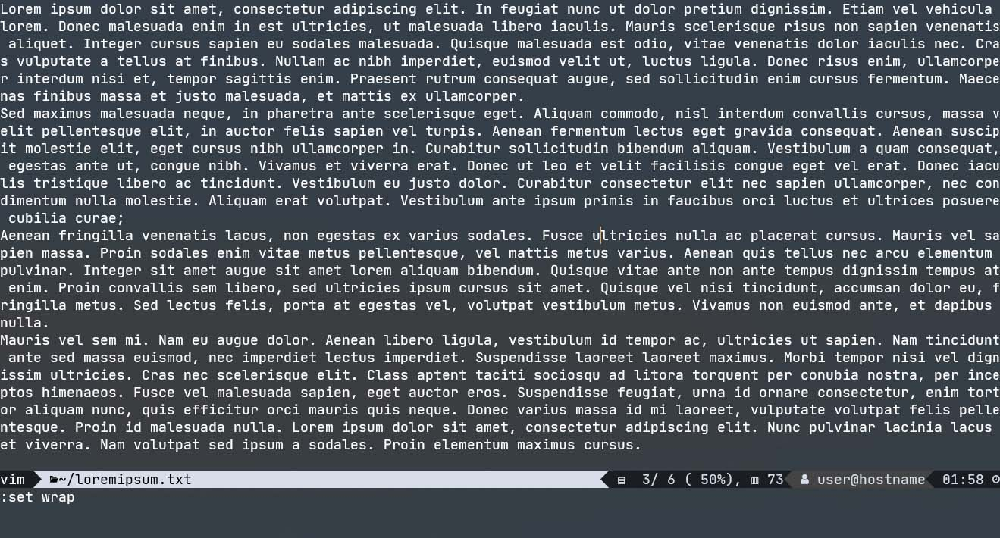

Modeless `vim`
==============

The config files in this repository turn `vim` into a modeless editor.
Instead of remembering cryptic commands, you can use standard key binds,
like `Ctrl+S` to save, select text using `Shift+←/→/↑/↓`, and copy/paste using
`Ctrl+C/V`.

This configuration is not meant for the aficionado who prefers `vim` over
  graphical editors. This is meant for people who normally use GUI editors
  (like VSCode), but sometimes need an editor that can run in a terminal.

#### Note:
A **modeless** editor is a normal editor in which the letter keys will let you
  directly type text, and commands like saving files are performed via key binds.
This applies to basically all editors with a GUI and
  some editors meant for terminals like `nano`.

A **modeful** editor like `vim` in its default configuration has several modes
  (e.g. 'command mode' for executing commands like saving ('w'), 'insert mode'
  for actually typing, 'visual mode' for selecting text, ...).

#### Q: Why don't you just learn the `vim` commands?

**A:** I did, but if you don't use `vim` regularly, you keep forgetting them.

#### Q: Why don't you use a modeless editor like `nano`?

**A:** The capabilities of `vim` (e.g. the syntax highlighting support for many
  languages) outclass any modeless terminal editor like `nano`.
  The configuration files in this repository turn `vim`
  into a modeless editor, while preserving its amazing features!

The configuration has been tested using `vim` version 8.2 running on
Debian 11 (Bullseye) running in WSL2 on Windows 10 21H2, displayed using the
'Windows Terminal' application.


Some features
-------------
* Support for standard [key binds](#key-bindings).
* Show an infobar at the top of the screen that reminds you of the key binds.
* Show a statusbar at the bottom with the file, the cursor position,
  and some other information.
* Sane default settings for many options.


Screenshots
-----------


*Modeless `vim` using a nerd font.*


*Modeless `vim` with the `_ascii` version of the config files.*


*`vi` aka modeful `vim` using `modeless.vimrc`.*


Contents
-------

* [Installation](#installation)
* [Nerd font](#nerd-font)
* [Key bindings](#key-bindings)
* [Files in this repository](#files-in-this-repository)
* [License](#license)


Installation
------------

* Clone this repository to `~/.vim`.
  You may want to use the following command to avoid cloning the screenshots
  in the `img` folder.
  ```sh
  git clone --sparse \
      https://github.com/SebastianMuskalla/ModelessVim.git \
      ~/.vim
  ```
* `vim` should autodetect the `vimrc` file in `~/.vim`.
* If it does not, you can create a symbolic link
  from `~/.vimrc` to e.g. `~/.vim/modeless.vimrc`:
  ```sh
  ln -s ~/.vim/modeless.vimrc ~/.vimrc
  ```

### Using `vim` for `sudoedit`

In order to use modeless `vim` when calling `sudoedit`, put
```sh
export EDITOR=vim
```
into your `.bashrc`/`.zshrc`/... file.

### Using modeful `vim` as `vi`

You may want to preserve the option to use the normal modeful version of `vim`.

I recommend a setup in which the `vi` command is set up to execute the modeful
  version of vim.

Find out what your `vi` command does
```sh
$ which vi
> /usr/bin/vi
$ ll /usr/bin/vi
> /usr/bin/vi -> /etc/alternatives/vi
$ ll /etc/alternatives/vi
>  /etc/alternatives/vi /usr/bin/vim.basic
```

The symlink `/usr/bin/vi` can be safely replaced by a shell script,
e.g. the file [vi](vi) in this repository
```sh
#!/bin/sh

if [ -e "$HOME/.vim/virc" ]
then
    vim -u "$HOME/.vim/virc" "$@"
else
    vim "$@"
fi
```


Nerd font
---------

The default configuration requires a nerd font (<https://www.nerdfonts.com>.)
(A nerd font is a monospace font that has additional icons inserted.)
To be precise, the infobar at the top and the statusbar at the bottom of the
terminal window use some of these custom icons.
Additionally, your terminal should support displaying unicode characters.

I recommend using a Nerd Font; I am using the nerd font version of
JetBrainsMono.

If you don't want or cannot use a custom font, this repository contains
the files `statusline_ascii.vimrc` and `infoline_ascii.vimrc`
that implement the statusbar/infobar just using ASCII characters.

Follow the instructions inside the file `modeless.vimrc` (or `modeful.vimrc`)
to use the `_ascii` version.


Key bindings
------------

Modeless `vim` supports the following file

**Open, Save, Quit**
* `Ctrl+Q` - Close all tabs, ask for saving each (Saving will not work if a file has no name)
* `Ctrl+W` - Close current tab, ask for saving (Saving will not work if a file has no name)
* `Ctrl+O` - Open file (enter file name)
* `Ctrl+S` - Save current file (enter file name if needed)

**Search and replace**
* `Ctrl+F` - Find
* `F3` - Next search result
* `F4` - Previous search result
* `Ctrl+R` - Replace all occurrences of a text.\
    Replace the text `FIND` by the text you want to replace,
    and the text `REPLACE` by the text you want to replace it with.

**Select, cut, copy, paste**
* `Ctrl+A` - Select all.
* `Shift+Left`, `Shift+Right`, `Shift+Down`, `Shift+Up`\
Select in the corresponding direction. Leave selection mode with arrow keys or Escape.
* `Ctrl+C` - Copy current selection (or current line if nothing is selected)
* `Ctrl+X` - Cut current selection (or current line if nothing is selected)
* `Ctrl+D` - Cut current line (which can be used to simply delete the line)
* `Ctrl+V` - Paste

**Other**
* `Ctrl+Z` - Undo
* `Ctrl+Y` - Redo
* `Shift+Tab` - De-tab (go back 4 spaces)
* `Ctrl+L` - Toggle line numbers (helpful when copying from terminal window)
* `Ctrl+N`, `Ctrl+B` - Next commands in "normal" vim mode\
    This key bind allows the user to input `vim` commands like `:q!`.

* `F2` - Toggle pastemode.\
  In pastemode, `vim` will not try to reformat text that is pasted into vim.
  This is useful when copying text from another editor into vim.


Files in this repository
------------------------

* [modeless.vimrc](modeless.vimrc)\
  Loads the settings for modeless `vim`.

* [modeful.vimrc](modeful.vimrc)\
  Loads some settings for modeful `vim`.

* [colorscheme.vimrc](colorscheme.vimrc)\
  Color scheme (meant for white text on a dark background).

* [keybinds.vimrc](keybinds.vimrc)\
  Key binds.

* [infoline_nerdfont.vimrc](infoline_nerdfont.vimrc)\
  Infoline on top that shows the keybinds.

* [infoline_ascii.vimrc](infoline_ascii.vimrc)\
  Version of `infoline_nerdfont.vimrc` that only uses ASCII.

* [statusline_nerdfont.vimrc](statusline_nerdfont.vimrc)\
  Statusline at the bottom that shows file name, cursor location,
  user, hostname, clock.

* [statusline_ascii.vimrc](statusline_ascii.vimrc)\
  Version of `statusline_nerdfont.vimrc` that only uses ASCII.

* [options_basic.vimrc](options_basic.vimrc)\
  Basic options for modeful and modeless `vim`.

* [options_modeless.vimrc](options_modeless.vimrc)\
  Options for modeless `vim`.

* [vimrc](vimrc)\
  Vimrc file that simply loads `modeless.vimrc`.
  Should be auto-detected by `vim` if placed inside `~/.vim`.

* [virc](virc)\
  Vimrc file that simply loads `modeful.vimrc`.

* [vi](vi)\
  Script that tries to load `~/.vim/modeless.vimrc`.

* [LICENSE](LICENSE)\
  MIT License.

* [README.md](README.md)\
  This README file.


License
-------

This collection of configuration files is free and open-source software,
licensed under the MIT license, see [LICENSE](LICENSE).
